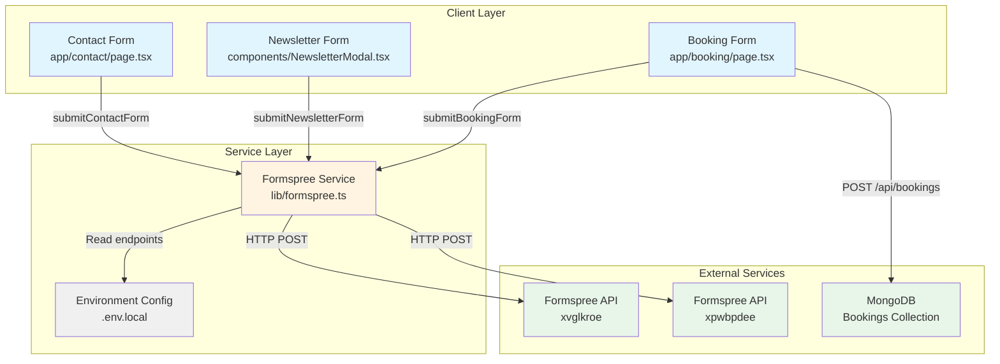
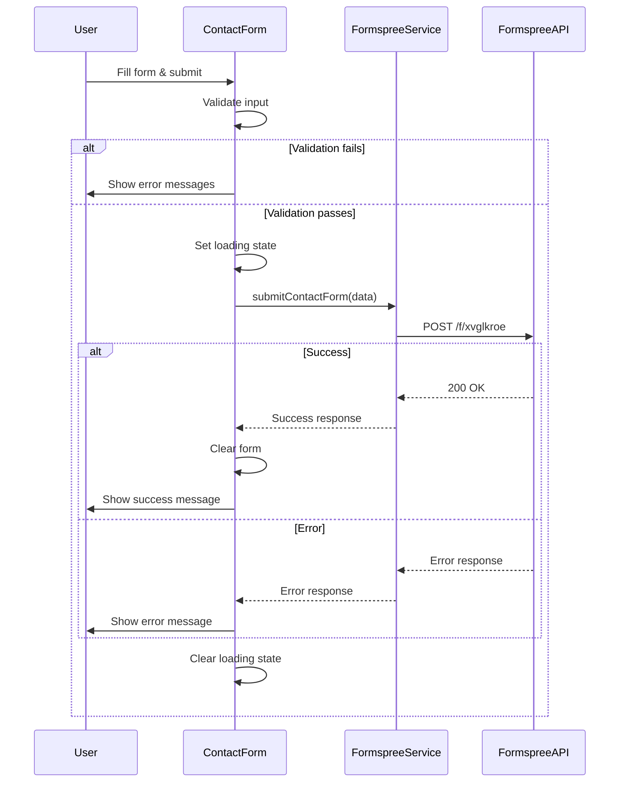
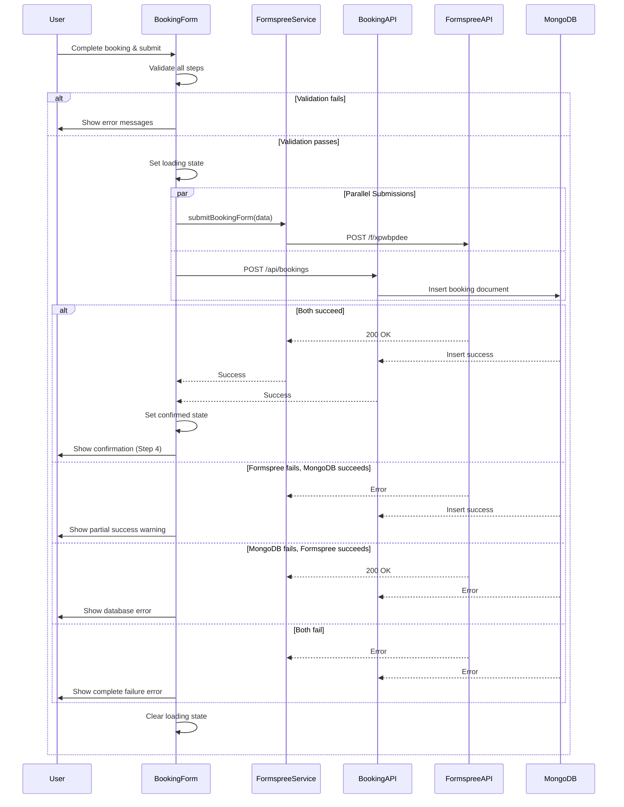

# Technical Design Document: Formspree Integration

## Overview

This document specifies the technical design for integrating Formspree email service into the NECHABEST 2.0 application. The integration will add email notification capabilities to three existing forms (Contact, Newsletter, Booking) while **preserving all existing UI/UX elements completely unchanged**. Only the form submission logic will be modified to include Formspree API calls.

### Design Principles

1. **Zero UI Changes**: All existing components, styling, layouts, and visual elements remain untouched
2. **Logic-Only Integration**: Only modify form submission handlers and add backend utilities
3. **Backward Compatibility**: Maintain existing functionality (MongoDB storage for bookings)
4. **Progressive Enhancement**: Add Formspree as an additional notification channel
5. **Error Resilience**: Graceful degradation if Formspree service is unavailable

### Integration Scope

| Form | Location | Formspree Endpoint | Additional Storage |
|------|----------|-------------------|-------------------|
| Contact Form | `app/contact/page.tsx` | `https://formspree.io/f/xvglkroe` | None |
| Newsletter Form | `components/NewsletterModal.tsx` | `https://formspree.io/f/xvglkroe` | None |
| Booking Form | `app/booking/page.tsx` | `https://formspree.io/f/xpwbpdee` | MongoDB (existing) |

## Architecture

### System Architecture Diagram



### Data Flow

#### Contact Form Submission Flow



#### Booking Form Dual Submission Flow



## Components and Interfaces

### 1. Formspree Service Utility (`lib/formspree.ts`)

**Purpose**: Centralized service for all Formspree API interactions

**Interface**:

```typescript
// lib/formspree.ts

export interface FormspreeResponse {
  success: boolean;
  message?: string;
  error?: string;
}

export interface ContactFormData {
  name: string;
  email: string;
  phone?: string;
  subject: string;
  message: string;
}

export interface NewsletterFormData {
  email: string;
  name?: string;
}

export interface BookingFormData {
  tourId: string;
  tourTitle: string;
  fullName: string;
  email: string;
  phone: string;
  numberOfPeople: number;
  bookingDate: string;
  totalPrice: number;
  specialRequests?: string;
}

/**
 * Submit contact form to Formspree
 */
export async function submitContactForm(
  data: ContactFormData
): Promise<FormspreeResponse>;

/**
 * Submit newsletter subscription to Formspree
 */
export async function submitNewsletterForm(
  data: NewsletterFormData
): Promise<FormspreeResponse>;

/**
 * Submit booking form to Formspree
 */
export async function submitBookingForm(
  data: BookingFormData
): Promise<FormspreeResponse>;
```

**Implementation Strategy**:

1. Use native `fetch` API for HTTP requests
2. Set `Content-Type: application/json` header
3. Handle network errors with try-catch
4. Return normalized response format
5. Log errors to console for debugging
6. Read endpoints from environment variables

### 2. Environment Configuration

**File**: `.env.local`

**New Variables**:

```bash
# Formspree Integration
NEXT_PUBLIC_FORMSPREE_CONTACT_ENDPOINT=https://formspree.io/f/xvglkroe
NEXT_PUBLIC_FORMSPREE_BOOKING_ENDPOINT=https://formspree.io/f/xpwbpdee
```

**Rationale**: 
- Use `NEXT_PUBLIC_` prefix for client-side access
- Centralize endpoint configuration
- Enable easy endpoint updates without code changes

### 3. Contact Form Modifications

**File**: `app/contact/page.tsx`

**Changes** (Logic Only):

1. Import Formspree service
2. Modify `handleSubmit` function to call `submitContactForm`
3. Update error handling to display Formspree errors
4. Maintain existing validation logic
5. Keep all UI components unchanged

**Modified Logic Flow**:

```typescript
// Existing validation remains unchanged
const handleSubmit = async (e: React.FormEvent<HTMLFormElement>) => {
  e.preventDefault();
  
  if (!validateForm()) return;

  setLoading(true);
  
  try {
    // NEW: Call Formspree service
    const result = await submitContactForm({
      name: formData.name,
      email: formData.email,
      phone: formData.phone,
      subject: formData.subject,
      message: formData.message
    });

    if (!result.success) {
      throw new Error(result.error || 'Failed to submit form');
    }

    // Existing success handling
    setLoading(false);
    setSubmitted(true);
    setFormData({
      name: '',
      email: '',
      phone: '',
      subject: '',
      message: ''
    });

    setTimeout(() => setSubmitted(false), 5000);
  } catch (error) {
    console.error('Contact form submission error:', error);
    setLoading(false);
    setErrors({ 
      ...errors, 
      submit: error instanceof Error ? error.message : 'Failed to submit form. Please try again.' 
    });
  }
};
```

**UI Elements Preserved**:
- All input fields and styling
- Loading spinner animation
- Success message display
- Error message display
- Form layout and responsiveness

### 4. Newsletter Form Modifications

**File**: `components/NewsletterModal.tsx`

**Changes** (Logic Only):

1. Import Formspree service
2. Modify `handleSubmit` function to call `submitNewsletterForm`
3. Update error handling
4. Maintain existing validation
5. Keep all UI components unchanged

**Modified Logic Flow**:

```typescript
const handleSubmit = async (e: React.FormEvent) => {
  e.preventDefault();
  setError('');
  setLoading(true);

  // Existing validation
  const emailRegex = /^[^\s@]+@[^\s@]+\.[^\s@]+$/;
  if (!emailRegex.test(email)) {
    setError('Please enter a valid email address');
    setLoading(false);
    return;
  }

  try {
    // NEW: Call Formspree service
    const result = await submitNewsletterForm({
      email,
      name
    });

    if (!result.success) {
      throw new Error(result.error || 'Failed to subscribe');
    }

    // Existing success handling
    setSubmitted(true);
    setEmail('');
    setName('');

    setTimeout(() => {
      setSubmitted(false);
      onClose();
    }, 2000);
  } catch (err: any) {
    setError(err.message || 'Failed to subscribe. Please try again.');
  } finally {
    setLoading(false);
  }
};
```

**UI Elements Preserved**:
- Modal backdrop and positioning
- Input fields and styling
- Loading state animation
- Success checkmark animation
- Error message display
- Close button functionality

### 5. Booking Form Modifications

**File**: `app/booking/page.tsx`

**Changes** (Logic Only):

1. Import Formspree service
2. Modify `handleSubmit` function for dual submission
3. Implement parallel API calls (Formspree + MongoDB)
4. Enhanced error handling for partial failures
5. Maintain existing validation across all steps
6. Keep all UI components unchanged

**Modified Logic Flow**:

```typescript
const handleSubmit = async () => {
  if (!validateStep(3)) return;

  setLoading(true);
  
  try {
    // Prepare booking data
    const bookingPayload = {
      tourId: bookingData.tourId,
      tourTitle: selectedTour?.title || '',
      fullName: bookingData.fullName,
      email: bookingData.email,
      phone: bookingData.phone,
      numberOfPeople: bookingData.numberOfPeople,
      bookingDate: bookingData.startDate,
      totalPrice,
      specialRequests: bookingData.specialRequests || ''
    };

    // NEW: Parallel submissions
    const [formspreeResult, mongoResult] = await Promise.allSettled([
      submitBookingForm(bookingPayload),
      fetch('/api/bookings', {
        method: 'POST',
        headers: { 'Content-Type': 'application/json' },
        body: JSON.stringify(bookingPayload)
      }).then(res => res.json())
    ]);

    // Check results
    const formspreeSuccess = formspreeResult.status === 'fulfilled' && formspreeResult.value.success;
    const mongoSuccess = mongoResult.status === 'fulfilled' && mongoResult.value.success;

    if (formspreeSuccess && mongoSuccess) {
      // Both succeeded
      setLoading(false);
      setConfirmed(true);
      setStep(4);
      window.scrollTo({ top: 0, behavior: 'smooth' });
    } else if (!formspreeSuccess && mongoSuccess) {
      // MongoDB succeeded, Formspree failed
      throw new Error('Booking saved but email notification failed. We will contact you shortly.');
    } else if (formspreeSuccess && !mongoSuccess) {
      // Formspree succeeded, MongoDB failed
      throw new Error('Email sent but failed to save booking. Please contact us directly.');
    } else {
      // Both failed
      throw new Error('Failed to submit booking. Please try again or contact us directly.');
    }
  } catch (error) {
    console.error('Booking submission error:', error);
    setLoading(false);
    setErrors({ 
      submit: error instanceof Error ? error.message : 'Failed to submit booking. Please try again.' 
    });
  }
};
```

**UI Elements Preserved**:
- All 4 steps and step indicator
- Tour selection cards
- Form inputs and styling
- Date picker and number inputs
- Review summary display
- Loading spinner
- Confirmation page (Step 4)
- All animations and transitions

## Data Models

### Formspree Request Payload

**Contact Form**:
```json
{
  "name": "John Doe",
  "email": "john@example.com",
  "phone": "+256 700 000 000",
  "subject": "General Inquiry",
  "message": "I would like to know more about your tours..."
}
```

**Newsletter Form**:
```json
{
  "email": "subscriber@example.com",
  "name": "Jane Smith"
}
```

**Booking Form**:
```json
{
  "tourId": "tour_123",
  "tourTitle": "Gorilla Trekking Adventure",
  "fullName": "John Doe",
  "email": "john@example.com",
  "phone": "+256 700 000 000",
  "numberOfPeople": 2,
  "bookingDate": "2024-06-15",
  "totalPrice": 1500,
  "specialRequests": "Vegetarian meals preferred"
}
```

### Formspree Response Format

**Success Response**:
```json
{
  "ok": true,
  "next": "https://formspree.io/thanks"
}
```

**Error Response**:
```json
{
  "ok": false,
  "error": "Invalid email address",
  "errors": [
    {
      "field": "email",
      "message": "is not a valid email address"
    }
  ]
}
```

### MongoDB Booking Document

**Existing Schema** (Unchanged):
```typescript
{
  tourId: string;
  tourTitle: string;
  fullName: string;
  email: string;
  phone: string;
  numberOfPeople: number;
  bookingDate: Date;
  totalPrice: number;
  specialRequests: string;
  status: 'pending' | 'confirmed' | 'cancelled';
  createdAt: Date;
  read: boolean;
}
```

## Error Handling

### Error Categories

1. **Validation Errors**: Client-side validation failures
2. **Network Errors**: Connection issues, timeouts
3. **API Errors**: Formspree service errors (4xx, 5xx)
4. **Partial Failures**: One service succeeds, another fails (booking form only)

### Error Handling Strategy

#### Contact & Newsletter Forms

```typescript
try {
  const result = await submitFormspreeForm(data);
  if (!result.success) {
    throw new Error(result.error || 'Submission failed');
  }
  // Show success
} catch (error) {
  console.error('Form submission error:', error);
  // Show user-friendly error message
  // Keep form data intact for retry
}
```

#### Booking Form (Dual Submission)

```typescript
const [formspreeResult, mongoResult] = await Promise.allSettled([
  submitBookingForm(data),
  submitToMongoDB(data)
]);

// Determine outcome
if (both succeed) {
  // Full success - show confirmation
} else if (formspree fails, mongo succeeds) {
  // Partial success - booking saved, email failed
  // Show warning: "Booking saved but email notification failed"
} else if (formspree succeeds, mongo fails) {
  // Partial success - email sent, database failed
  // Show error: "Email sent but failed to save booking"
} else {
  // Complete failure
  // Show error: "Failed to submit booking"
}
```

### Error Messages

| Scenario | User Message | Technical Action |
|----------|-------------|------------------|
| Network error | "Network error. Please check your connection and try again" | Log error, keep form data |
| Formspree API error | "Failed to submit form. Please try again" | Log error details, keep form data |
| Validation error | Specific field error (e.g., "Email is required") | Highlight field, show inline error |
| Booking: Formspree fails | "Booking saved but email notification failed. We will contact you shortly." | Log error, show partial success |
| Booking: MongoDB fails | "Email sent but failed to save booking. Please contact us directly." | Log error, show partial success |
| Booking: Both fail | "Failed to submit booking. Please try again or contact us directly." | Log both errors, keep form data |

## Testing Strategy

### Testing Approach

This feature involves integration with an external service (Formspree) and existing infrastructure (MongoDB). Property-based testing is **NOT appropriate** for this feature because:

1. **External Service Integration**: Testing Formspree API behavior is outside our control
2. **Side-Effect Operations**: Form submissions trigger emails and database writes
3. **Configuration Validation**: Testing endpoint configuration doesn't benefit from randomization
4. **UI Integration**: Testing form submission flows requires specific user interactions

Instead, we will use:
- **Unit tests** for the Formspree service utility
- **Integration tests** with mocked Formspree API
- **End-to-end tests** for complete form submission flows
- **Manual testing** for email delivery verification

### Unit Tests

**Test File**: `lib/__tests__/formspree.test.ts`

**Test Cases**:

1. **Contact Form Submission**
   - ✓ Should successfully submit valid contact form data
   - ✓ Should handle Formspree API errors gracefully
   - ✓ Should handle network errors
   - ✓ Should include all required fields in request
   - ✓ Should set correct Content-Type header

2. **Newsletter Form Submission**
   - ✓ Should successfully submit valid newsletter data
   - ✓ Should handle optional name field
   - ✓ Should handle Formspree API errors
   - ✓ Should validate email format before submission

3. **Booking Form Submission**
   - ✓ Should successfully submit valid booking data
   - ✓ Should include all booking fields in request
   - ✓ Should handle Formspree API errors
   - ✓ Should format dates correctly

4. **Error Handling**
   - ✓ Should return normalized error response on failure
   - ✓ Should log errors to console
   - ✓ Should not expose sensitive data in error messages

**Test Implementation Pattern**:

```typescript
describe('submitContactForm', () => {
  beforeEach(() => {
    global.fetch = jest.fn();
  });

  it('should successfully submit valid contact form data', async () => {
    (global.fetch as jest.Mock).mockResolvedValueOnce({
      ok: true,
      json: async () => ({ ok: true })
    });

    const result = await submitContactForm({
      name: 'John Doe',
      email: 'john@example.com',
      subject: 'Test',
      message: 'Test message'
    });

    expect(result.success).toBe(true);
    expect(global.fetch).toHaveBeenCalledWith(
      expect.stringContaining('formspree.io'),
      expect.objectContaining({
        method: 'POST',
        headers: { 'Content-Type': 'application/json' }
      })
    );
  });

  it('should handle Formspree API errors gracefully', async () => {
    (global.fetch as jest.Mock).mockResolvedValueOnce({
      ok: false,
      json: async () => ({ error: 'Invalid email' })
    });

    const result = await submitContactForm({
      name: 'John Doe',
      email: 'invalid',
      subject: 'Test',
      message: 'Test'
    });

    expect(result.success).toBe(false);
    expect(result.error).toBeDefined();
  });
});
```

### Integration Tests

**Test File**: `app/__tests__/forms-integration.test.tsx`

**Test Cases**:

1. **Contact Form Integration**
   - ✓ Should display validation errors for empty fields
   - ✓ Should show loading state during submission
   - ✓ Should display success message on successful submission
   - ✓ Should clear form after successful submission
   - ✓ Should display error message on submission failure
   - ✓ Should keep form data on submission failure

2. **Newsletter Form Integration**
   - ✓ Should validate email format
   - ✓ Should show loading state during submission
   - ✓ Should display success animation on subscription
   - ✓ Should close modal after successful subscription
   - ✓ Should display error message on failure

3. **Booking Form Integration**
   - ✓ Should validate all steps before submission
   - ✓ Should show loading state during submission
   - ✓ Should handle dual submission (Formspree + MongoDB)
   - ✓ Should display confirmation on full success
   - ✓ Should display appropriate error for partial failures
   - ✓ Should display error for complete failure

**Test Implementation Pattern**:

```typescript
describe('Contact Form Integration', () => {
  it('should display success message on successful submission', async () => {
    const mockSubmit = jest.fn().mockResolvedValue({ success: true });
    jest.mock('@/lib/formspree', () => ({
      submitContactForm: mockSubmit
    }));

    render(<Contact />);

    // Fill form
    fireEvent.change(screen.getByLabelText(/name/i), {
      target: { value: 'John Doe' }
    });
    fireEvent.change(screen.getByLabelText(/email/i), {
      target: { value: 'john@example.com' }
    });
    fireEvent.change(screen.getByLabelText(/subject/i), {
      target: { value: 'Test Subject' }
    });
    fireEvent.change(screen.getByLabelText(/message/i), {
      target: { value: 'Test message content' }
    });

    // Submit
    fireEvent.click(screen.getByRole('button', { name: /send message/i }));

    // Wait for success message
    await waitFor(() => {
      expect(screen.getByText(/message sent successfully/i)).toBeInTheDocument();
    });

    // Verify form cleared
    expect(screen.getByLabelText(/name/i)).toHaveValue('');
  });
});
```

### Manual Testing Checklist

**Contact Form**:
- [ ] Submit with all fields filled - verify email received
- [ ] Submit with missing required fields - verify validation errors
- [ ] Submit with invalid email - verify validation error
- [ ] Submit with network disconnected - verify error message
- [ ] Verify loading state displays during submission
- [ ] Verify success message displays after submission
- [ ] Verify form clears after successful submission

**Newsletter Form**:
- [ ] Submit with valid email - verify email received
- [ ] Submit with invalid email - verify validation error
- [ ] Submit with optional name - verify name included in email
- [ ] Submit without name - verify submission succeeds
- [ ] Verify modal closes after successful subscription
- [ ] Verify success animation displays

**Booking Form**:
- [ ] Complete all 3 steps and submit - verify both email and database record
- [ ] Verify email contains all booking details
- [ ] Verify MongoDB document created correctly
- [ ] Test with Formspree endpoint unavailable - verify partial success handling
- [ ] Test with MongoDB unavailable - verify partial success handling
- [ ] Verify confirmation page displays on full success
- [ ] Verify appropriate error messages for all failure scenarios

### Test Coverage Goals

- **Unit Tests**: 90%+ coverage for `lib/formspree.ts`
- **Integration Tests**: Cover all form submission paths
- **Manual Tests**: Verify email delivery and content
- **Error Scenarios**: Test all error handling paths

## Security Considerations

### Data Protection

1. **HTTPS Only**: All Formspree requests use HTTPS
2. **No Sensitive Logging**: Do not log email, phone, or personal data to console
3. **Input Sanitization**: Validate and sanitize all user inputs before submission
4. **No Client Storage**: Do not store form data in localStorage or sessionStorage
5. **CORS Handling**: Formspree handles CORS automatically

### Environment Variables

1. **Public Endpoints**: Formspree endpoints are safe to expose client-side
2. **No Secrets**: No API keys or secrets required for Formspree
3. **Endpoint Validation**: Validate endpoint URLs are HTTPS

### Rate Limiting

1. **Formspree Limits**: Free tier has submission limits
2. **Client-Side Prevention**: Disable submit button during submission
3. **Error Handling**: Handle rate limit errors gracefully

### Data Validation

```typescript
// Example validation before submission
function validateContactData(data: ContactFormData): boolean {
  // Email format
  if (!/^[^\s@]+@[^\s@]+\.[^\s@]+$/.test(data.email)) {
    return false;
  }
  
  // Required fields
  if (!data.name.trim() || !data.subject.trim() || !data.message.trim()) {
    return false;
  }
  
  // Message length
  if (data.message.trim().length < 10) {
    return false;
  }
  
  // Phone format (if provided)
  if (data.phone && !/^[\d\s\-\+\(\)]+$/.test(data.phone)) {
    return false;
  }
  
  return true;
}
```

## Implementation Plan

### Phase 1: Core Service Implementation

1. Create `lib/formspree.ts` utility
2. Add environment variables to `.env.local`
3. Implement `submitContactForm` function
4. Implement `submitNewsletterForm` function
5. Implement `submitBookingForm` function
6. Add error handling and logging

### Phase 2: Contact Form Integration

1. Import Formspree service in `app/contact/page.tsx`
2. Modify `handleSubmit` function
3. Update error handling
4. Test form submission
5. Verify email delivery

### Phase 3: Newsletter Form Integration

1. Import Formspree service in `components/NewsletterModal.tsx`
2. Modify `handleSubmit` function
3. Update error handling
4. Test form submission
5. Verify email delivery

### Phase 4: Booking Form Integration

1. Import Formspree service in `app/booking/page.tsx`
2. Implement dual submission logic
3. Add parallel API calls with `Promise.allSettled`
4. Implement partial failure handling
5. Test all success/failure scenarios
6. Verify both email and database records

### Phase 5: Testing & Validation

1. Write unit tests for Formspree service
2. Write integration tests for all forms
3. Perform manual testing
4. Verify email content and formatting
5. Test error scenarios
6. Verify UI remains unchanged

### Phase 6: Documentation & Deployment

1. Update README with Formspree setup instructions
2. Document environment variables
3. Create deployment checklist
4. Deploy to staging environment
5. Perform end-to-end testing
6. Deploy to production

## Deployment Considerations

### Environment Setup

**Development**:
```bash
NEXT_PUBLIC_FORMSPREE_CONTACT_ENDPOINT=https://formspree.io/f/xvglkroe
NEXT_PUBLIC_FORMSPREE_BOOKING_ENDPOINT=https://formspree.io/f/xpwbpdee
```

**Production**:
- Same endpoints (Formspree handles environment separation)
- Verify endpoints are accessible
- Test email delivery to production addresses

### Rollback Plan

If issues arise:
1. Remove Formspree service imports from forms
2. Revert form submission handlers to original logic
3. Keep MongoDB integration intact for booking form
4. Forms will continue to work without email notifications

### Monitoring

1. **Client-Side**: Monitor console errors for Formspree failures
2. **Formspree Dashboard**: Check submission statistics
3. **Email Delivery**: Verify emails are being received
4. **MongoDB**: Verify booking records are created

### Performance Impact

- **Minimal**: Formspree adds ~200-500ms to form submission
- **Non-Blocking**: Parallel submissions for booking form
- **No UI Changes**: Existing loading states handle submission time

## Accessibility

All existing accessibility features are preserved:

1. **ARIA Labels**: All form inputs maintain existing labels
2. **Keyboard Navigation**: Tab order and Enter key submission unchanged
3. **Screen Readers**: Error messages announced via existing ARIA live regions
4. **Focus Management**: Focus behavior remains unchanged
5. **Color Contrast**: No visual changes, existing contrast ratios maintained

## Browser Compatibility

- **Fetch API**: Supported in all modern browsers
- **Promises**: Supported in all modern browsers
- **Async/Await**: Supported in all modern browsers
- **Fallback**: Not required (target audience uses modern browsers)

## Conclusion

This design provides a comprehensive integration of Formspree email service into the NECHABEST 2.0 application while maintaining complete UI/UX consistency. The implementation focuses on:

1. **Zero UI Changes**: All visual elements remain untouched
2. **Robust Error Handling**: Graceful degradation for all failure scenarios
3. **Dual Submission**: Booking form maintains MongoDB storage while adding email notifications
4. **Testability**: Clear testing strategy with unit and integration tests
5. **Security**: Proper validation and data protection
6. **Maintainability**: Centralized service utility for easy updates

The design ensures that the integration enhances functionality without disrupting the existing user experience.
